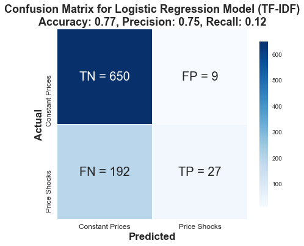
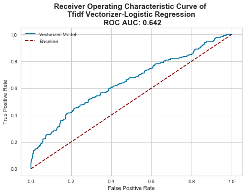
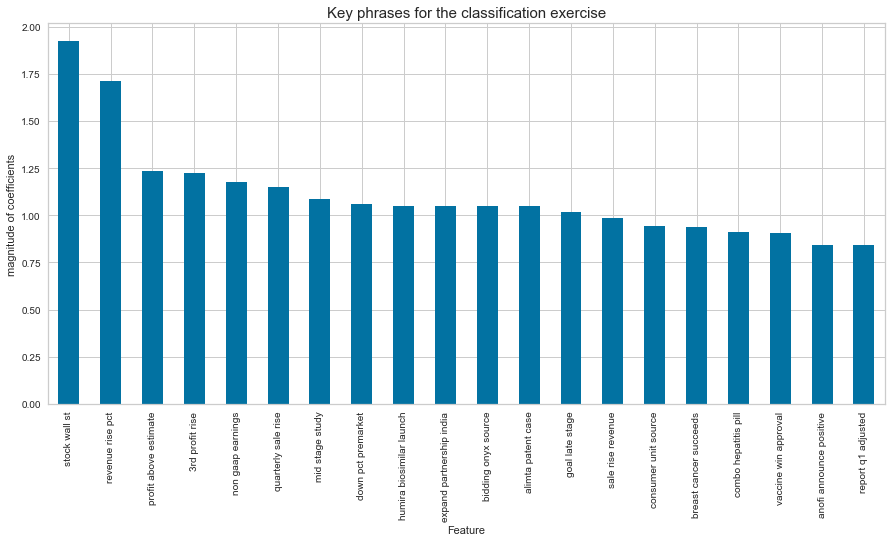
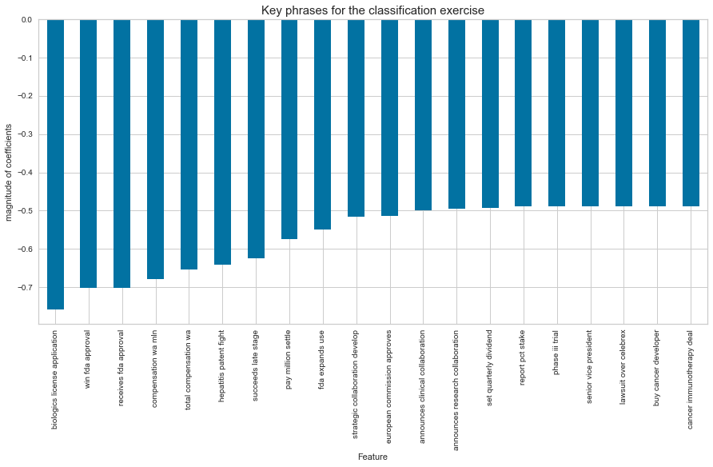

# Capstone Project: Predicting Stock Price Changes of  Healthcare Companies based on News Headlines

### Introduction 
Investing in healthcare companies is hard. Apart from understanding finance, a healthcare/ biotech investor/ trader also needs to understand the drug development process, the commercial applications of the cutting-edge scientific technologies and the regulatory frameworks/ processes that affect a drug's journey from lab to shelf. To bridge the knowledge gap and make healthcare investing more accessible for the layperson, this Natural Language Processing (NLP) project seeks to study whether and how news headlines affect healthcare company's stock prices. 

### Approach 
I scraped news and stock information related to 8 healthcare companies (Abbvie, Amgen, Biogen, Eli Lilly, Gilead, Merck, Pfizer, Regeneron) from Reuters and AlphaVantage API respectively. After data cleaning and aggregation, the data set contains 2,924 observations (ranging from Jan 2012 to Nov 2019) of daily stock closing price information alongside the relevant news headlines reported (trading days without news reporting are excluded from the dataset). Given this data set, I trained a supervised classification model to predict whether the stock price will increase or decrease by more than 1.31% (P75 of daily stock price changes) given a particular headline. 

Using the following vectorizers and estimators, I was able to achieve the following results using PyCaret's model comparison function:

|S/N|Model|Vectorizer|N-Gram|Accuracy|AUC|Recall|Precision|F1|
|:---|---:|:---:|:---:|:---:|:---:|:---:|:---:|:---:|
|1|Light Gradient Boosting Machine|Count|1-gram|0.764|0.625|0.248|0.549|0.339|
|2|Logistic Regression|Count|1-gram|0.764|0.651|0.307|0.529|0.386|
|3|Gradient Boosting Classifier|Count|2-gram|0.747|0.560|0.068|0.663|0.120|
|4|Logistic Regression|Count|2-gram|0.745|0.594|0.165|0.516|0.247|
|5|Gradient Boosting Classifier|Count|3-gram|0.749|0.522|0.046|0.496|0.084|
|6|Logistic Regression|Count|3-gram|0.747|0.538|0.060|0.493|0.106|
|**7**|**Logistic Regression**|**Tf-idf**|**1-gram**|**0.758**|**0.654**|**0.117**|**0.672**|**0.199**|
|8|K Neighbors Classifier|Tf-idf|1-gram|0.748|0.568|0.114|0.577|0.187|
|9|Logistic Regression|Tf-idf|2-gram|0.766|0.600|0.043|0.636|0.079|
|10|Gradient Boosting Classifier|Tf-idf|2-gram|0.764|0.600|0.080|0.524|0.135|
|11|Logistic Regression|Tf-idf|3-gram|0.748|0.570|0.006|0.150|0.011|
|12|Ada Boosting Classifier|Tf-idf|3-gram|0.748|0.533|0.066|0.511|0.116|

### Final Model & Results 

I chose to further train and tune the **1-gram count-vectorized logistic regression model** because it had the highest precision score and the accuracy and AUC scores were among the highest (i.e. fifth and second highest respectively). The final results are presented in the images below.

Confusion Matrix           |  AUC ROC
:-------------------------:|:-------------------------:
 |  

The model had an accuracy score of 0.77, a ROC AUC score of 0.642 and a 0.75 precision score. While the precision score was high, it was obtained at the expense of a lower recall score of 0.12. This means the model will be relatively good at predicting when a 'price-shocking' news headline. However, it is prone to classify many other news headlines which are price shockers as non-price shockers. This may lead to traders missing out on news events that would affect the stock prices significantly. 

Taking a closer look at the feature importances, I cannot find any discernable trends or patterns for single words that were indicative of an impending price shock. However, when we look at the three-word phrases, we see that features that affect prices more significantly tended to be related to financial reporting (i.e. quarterly profits/ sales reporting) or mid-stage to late-stage study/trial. Interestingly, the final announcement of the FDA/commission approval or success reported at late stage study tended to not lead to large changes in stock prices. This suggests that there may be some truth to the saying that traders 'buy the rumor, and sell the news' in the biotech or healthcare industry. Traders/investors may have already placed their bets or made their trade assessments based on interim updates on the companies' clinical trial results. While the final approval by regulatory bodies is a significant milestone for the healthcare companies, it may not lead to a significant jump in stock prices as the expected approval was already priced in by the trade activities before the actual announcement. 

|Phrases associated with Price Jumps     |     
|:-------------------------:|
 |  

|Phrases not associated with Price Jumps |
|:-------------------------:|
|

### Conclusions 

1. News headlines can be used to predict changes to stock prices. The tf-idf logistic regression model is able to achieve > 70% accuracy and precision scores, and > 60% AUC ROC score.   

2. The release of positive/ negative news may not necessarily lead to a jump in stock prices. From this modelling experience, we learn that the announcement of significant milestones (such as FDA approval) may not lead to significant stock price changes.  

### Recommendations for Future Projects to Improve Use Case and Model Performance
   - Aggregate news headlines from more sources (e.g. Financial Times, Seeking Alpha) for analysis
   - Beyond headlines, there is also an opportunity to study how the long-form texts from news articles affect stock prices
   - Aggregate news headlines for more healthcare, pharmaceutical or biotech companies for analysis
   
   
### Jupyter Notebooks: 
- [Part 1 of 3](./codes/01-Introduction.ipynb)
- [Part 2 of 3](./codes/02-Data-Munging-and-EDA.ipynb)
- [Part 3 of 3](./codes/03-Model-&-Analysis.ipynb) 
- [Annex - News WebScraping](./codes/Annex_Webscraping.ipynb) 
- [Annex - Further Scraping & Cleaning](./codes/Annex_Webscraping_and_Cleaning_Headlines.ipynb)